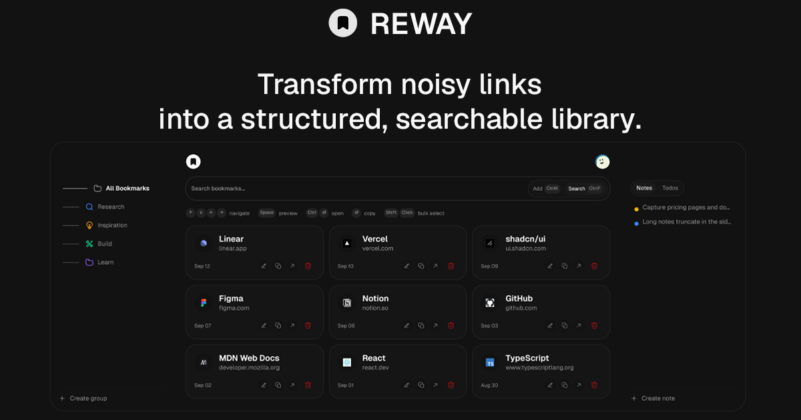

# Reway

<div align="center">
  
</div>

Reway is a modern bookmark management application that provides intelligent organization, instant search, and seamless cross-device synchronization. It addresses the common problem of bookmark clutter across browsers and devices by offering a centralized, searchable repository with advanced grouping capabilities.

Reway also ships with a Chrome MV3 extension that lets you save pages instantly and open bookmark groups in one click.

## Problem Statement

Traditional bookmark management suffers from several limitations:

- Browser-specific storage creates silos across devices
- Limited organization capabilities beyond basic folders
- Poor search functionality within bookmark collections
- No intelligent metadata enrichment or preview capabilities
- Difficult to share or export bookmark collections systematically

Reway solves these problems by providing a unified platform with enhanced organization, real-time synchronization, and intelligent content discovery.

## Architecture

### Core Components

**Frontend Application**

- Built with Next.js 16 using the App Router pattern
- TypeScript for type safety and better developer experience
- Tailwind CSS with shadcn/ui components for consistent design
- React state management with optimistic updates for responsive UI

**Backend Infrastructure**

- Supabase as the primary database and authentication provider
- PostgreSQL database with Row Level Security (RLS) policies
- Real-time subscriptions using Supabase broadcast channels
- Server-side API routes for bookmark operations and metadata enrichment

**Browser Extension**

- Chrome MV3 extension for instant bookmark capture
- Background service worker for multi-tab operations
- Content script integration for page metadata extraction

## Features

### Capture

- Save the current tab from the browser extension.
- Smart link extraction from pasted text (regex-based) to quickly add multiple bookmarks.
- Extract and enrich link metadata (title, favicon, preview image) for cleaner libraries.
- Duplicate detection and clearer duplicate actions (including allowing duplicates across different groups).

### Organize

- Groups with icons/colors and an 18-character name limit with inline character counter.
- Group reordering with drag and drop.
- Optimistic group deletion with cascade removal of bookmarks plus undo.
- Context menus and improved sidebar controls for fast group operations.

### Browse and act fast

- Keyboard-first navigation and reliable key handling (including Space/Enter behavior).
- Multiple view modes (list/cards/icons) tuned for different density preferences.
- Bulk selection workflows and “open selected” via extension, with safe staggered popup fallback.

### Personalization

- Theme system with multiple palette themes and light/dark/system modes.
- Cookie-based dashboard preferences.

### Notes and Todos

- Optional Notes & Todos sidebar on desktop.
- Restore functionality for notes and todos.

### UX, motion, and accessibility

- Reduced-motion guards across landing, auth, legal pages, and dashboard.
- Shorter, stricter dashboard animation timings to reduce jank and meet motion standards.
- Improved accessible names/ARIA for icon-only actions and toggles.

### Sharing and previews

- Dynamic OpenGraph images generated per page (clean endpoints like `/about/api/og`).

### Database Schema

The application uses three primary tables:

```sql
bookmarks
- id, url, normalized_url, title, description
- group_id, user_id, status, order_index
- favicon_url, og_image_url, image_url
- created_at, last_fetched_at

groups
- id, name, icon, color, user_id
- order_index, created_at
```

### Real-time Architecture

Reway uses Supabase broadcast triggers for scalable real-time updates:

- User-specific private channels (`user:{userId}:bookmarks`, `user:{userId}:groups`)
- Postgres triggers broadcast changes on INSERT/UPDATE/DELETE operations
- Client-side subscriptions update UI instantly without page refreshes
- Extension integration broadcasts new bookmarks to open dashboard tabs

## Technology Choices

### Frontend Stack

**Next.js 16**

- App Router provides better file-based routing and layout patterns
- Server components enable efficient data fetching and caching
- Built-in optimizations for images, fonts, and performance
- Strong TypeScript integration with excellent developer experience

**React 19**

- Concurrent features for better user experience
- Improved server-side rendering capabilities
- Enhanced developer tools and debugging support

**Tailwind CSS + shadcn/ui**

- Utility-first CSS for rapid development
- Consistent design system with accessible components
- Dark mode support built into the design tokens
- Customizable theme system matching brand requirements

### Backend Stack

**Supabase**

- Managed PostgreSQL with automatic backups and scaling
- Built-in authentication with social providers
- Real-time subscriptions with broadcast channels
- Row Level Security for secure multi-tenant data access

**PostgreSQL**

- Advanced indexing for fast bookmark search and filtering
- JSON support for flexible metadata storage
- Full-text search capabilities for content discovery
- Strong consistency and ACID compliance

### Extension Technology

**Chrome MV3**

- Modern extension API with improved security model
- Service workers for background processing
- Cross-origin fetch capabilities for API communication
- Manifest V3 requirements for future Chrome compatibility

## Development Setup

### Prerequisites

- Node.js 18 or higher
- pnpm package manager
- Supabase account and project
- Chrome browser for extension development

### Installation

1. Clone the repository:

```bash
git clone https://github.com/mohamed-g-shoaib/reway.git
cd reway
```

2. Install dependencies:

```bash
pnpm install
```

3. Environment setup:

```bash
cp .env.example .env.local
```

Configure the following environment variables:

```env
NEXT_PUBLIC_SITE_URL=http://localhost:3000
NEXT_PUBLIC_SUPABASE_URL=your-project-url
NEXT_PUBLIC_SUPABASE_PUBLISHABLE_KEY=your-publishable-or-anon-key
SUPABASE_SERVICE_ROLE_KEY=your_actual_key_here
```

4. Database setup:

```bash
pnpm run db:push
```

5. Start development server:

```bash
pnpm run dev
```

6. Extension development:

```bash
# Load extension in Chrome
# Navigate to chrome://extensions/
# Enable Developer mode
# Click "Load unpacked" and select the extension/ directory
```

### Project Structure

```
reway/
├── app/                    # Next.js app router
│   ├── api/               # API routes
│   ├── dashboard/         # Dashboard pages
│   └── globals.css        # Global styles
├── components/            # React components
│   ├── dashboard/         # Dashboard-specific components
│   └── ui/               # Reusable UI components
├── extension/             # Chrome extension
│   ├── manifest.json     # Extension configuration
│   ├── popup.html/js/css # Extension popup
│   └── background.js     # Service worker
├── lib/                   # Utility libraries
│   ├── supabase/         # Database client
│   └── tokens.ts         # Token management
└── docs/                 # Documentation
```

## API Endpoints

### Authentication

- `POST /api/auth/signin` - User authentication
- `POST /api/auth/signup` - User registration

### Bookmarks

- `GET /api/bookmarks` - List user bookmarks
- `POST /api/bookmarks` - Create new bookmark
- `PUT /api/bookmarks/[id]` - Update bookmark
- `DELETE /api/bookmarks/[id]` - Delete bookmark

### Extension API

- `GET /api/extension/bookmarks` - Extension bookmark list
- `POST /api/extension/bookmarks` - Extension bookmark creation
- `GET /api/extension/groups` - Extension groups list

## Security Considerations

### Data Protection

- Row Level Security policies enforce user data isolation
- HTTPS required for all API communications
- Input validation and sanitization on all endpoints
- SQL injection prevention through parameterized queries

### Extension Security

- Content Security Policy headers enforced
- Minimal permissions requested in manifest
- Secure token storage in Chrome local storage
- Background script isolation from content scripts

## Performance Optimizations

### Frontend

- React.memo and useMemo for component optimization
- Virtual scrolling for large bookmark lists
- Image optimization with Next.js Image component
- Code splitting for reduced bundle size

### Backend

- Database indexes on frequently queried columns
- Connection pooling for efficient database access
- Caching strategies for metadata enrichment
- Optimistic updates for responsive UI

### Real-time

- Broadcast channels instead of polling for efficiency
- User-specific channels to reduce unnecessary traffic
- Connection management with automatic reconnection
- Event debouncing to prevent update storms

## Contributing

1. Fork the repository
2. Create a feature branch: `git checkout -b feature-name`
3. Make changes and commit: `git commit -m "Add feature"`
4. Push to branch: `git push origin feature-name`
5. Open a pull request

### Development Guidelines

- Follow TypeScript strict mode requirements
- Use conventional commit messages
- Ensure all components have proper TypeScript types
- Write tests for new features and utilities
- Follow the established code formatting with Prettier

## License

This project is licensed under the MIT License. See the LICENSE file for details.

## Credits

This project is developed and maintained by [Devloop](https://www.devloop.software/)
